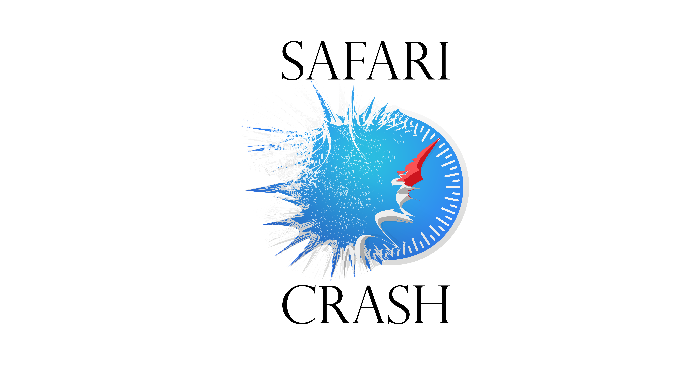

Safari Crash is a small exploit kit that bundles different Denial of Service HTML exploits (aimed at mobile browsers) into one tool. Using Bottle web framework, it allows for local deployment and testing of available PoC's.

## Table of Contents
- [Installation](#installation)
- [Demo](#usage)
- [License](#license)

## Installation
Go to the cloned repository and run `setup.py`:
`$ python setup.py install`
It will install all needed dependencies.
Then launch `safari_crash.py` from your terminal:
`$ python2.7 safari_crash.py`

## Demo

## License
This software is under [MIT License](https://en.wikipedia.org/wiki/MIT_License)